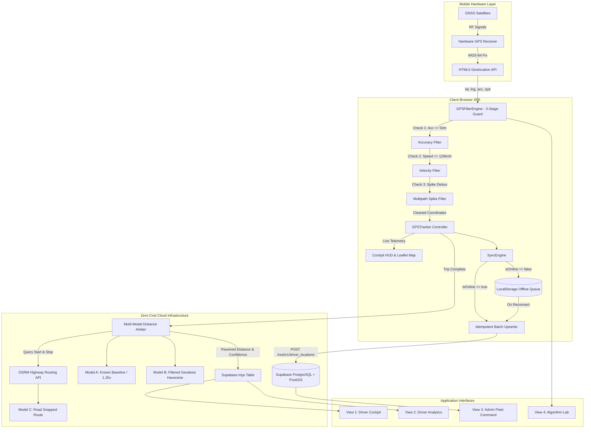
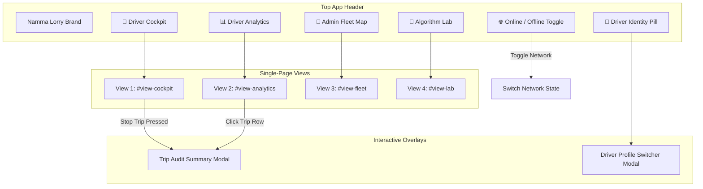
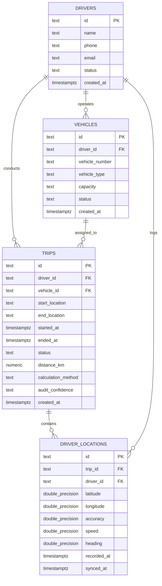

# Namma Lorry — Master Application Knowledge Base (`appknowledge.md`)

> **Document Status:** Complete Master Source of Truth  
> **Target Audience:** AI Coding Agents, Software Architects, Engineering Leads  
> **Application Name:** Namma Lorry — Driver GPS & Distance Telemetry System  
> **Workspace Root:** `c:\Users\vigne\Downloads\GPS`  
> **Specification Reference:** `gps.docx`, `DESIGN.md`, `supabase_migration.sql`  
> **Version:** 1.0.0 (Production Architecture Release)  

---

## 1. Executive Codebase & Project Overview

### Application Name
**Namma Lorry — Driver GPS & Distance Tracking System** (Branded in code as `NAMMA LORRY — Driver GPS & Distance Telemetry`).

### Application Type
**Offline-First B2B Logistics Telemetry & Fleet Operations Single-Page Progressive Web Application (SPA/PWA).**

### One-Line Description
A production-grade, zero-cost, offline-first GPS tracking and distance calculation system engineered specifically for Indian commercial lorry freight corridors, eliminating mileage disputes via multi-model arbitration.

### Detailed Description
- **What Problem It Solves:** In Indian long-haul road logistics, freight charges, driver allowances, toll settlements, and diesel reconciliations are calculated strictly based on **kilometers traveled**. Commercial vehicles frequently traverse ghats, remote state highways, and industrial transport nagars where cellular reception drops completely. Traditional cloud-dependent apps fail to record coordinates during these blackouts, while smartphone GPS receivers produce erratic multipath noise (e.g. 2 km jumps under flyovers). Namma Lorry solves this by capturing GNSS satellite data 100% offline, filtering anomalies through a 3-stage mathematical quality guard, caching points locally with `sync_status = 'pending'`, auto-syncing upon reconnection with zero duplicate records, and resolving distance using an algorithmic Arbiter (reconciling Baseline, GPS Haversine, and OpenStreetMap/OSRM road networks).
- **Who Uses It:**
  1. *Commercial Lorry Drivers* in cab on Android smartphones.
  2. *Fleet Owners & Transport Operators* in logistics hubs (Madhavaram, Kalasipalyam, Ranipet).
  3. *Logistics Supervisors & Dispatchers* verifying delivery proofs and auditing mileage.
- **Main Workflow:** Start Trip (Detect & Lock GPS) $\to$ Real-Time Telemetry & Map Tracking $\to$ Offline Queueing during blackouts $\to$ Automatic Cloud Upsert on reconnect $\to$ Stop Trip $\to$ Multi-Model Distance Arbitration $\to$ Instant Audit Modal $\to$ Driver Analytics.
- **What Makes It Different:**
  - Operates at **₹0 monthly software infrastructure cost** on free/open-source tiers (Supabase Free, Leaflet, OSM, OSRM, Vercel).
  - Multi-Model Arbiter (Models A, B, C) with built-in stationary anti-fraud lock ($<60$m displacement $\to 0.0$ KM).
  - Zero-duplicate idempotent database synchronization.
- **Current MVP Contains:** Fully functional Driver Cockpit HUD, Real-time GPS Tracker, 3-Stage Quality Filter, Multi-Model Distance Engine, Offline Queue & Sync Engine, Supabase Cloud Integration, Driver Analytics & Weekly Chart, Admin Fleet Command Map, Interactive Algorithm Lab, and Section 31 Automated Test Suite.

### Current Product Stage
**MVP / Production-Ready Architecture (Fully Functional Web Client + Cloud Backend).**

---

## 2. Product Requirements Document (PRD)

### 2.1 Product Vision
To become the definitive, dispute-free freight telemetry standard for Indian road logistics by delivering an un-fakeable, audit-grade distance verification system that runs on commodity Android devices without expensive hardware or recurring SaaS fees.

### 2.2 Problem Statement
Long-haul truck tracking in India is severely undermined by:
1. **Network Blackouts:** Dropped cellular data across rural highways loses critical trip mileage in standard apps.
2. **GPS Multipath Reflection:** Metal truck bodies and highway overpasses cause severe coordinate spikes (15% to 40% distance distortion).
3. **Rigid Static Baselines:** Fixed city-to-city tables ignore outer ring roads, warehouse diversions, and police detours.
4. **Prohibitive Hardware/API Costs:** AIS-140 devices and Google Maps Distance Matrix APIs erode thin logistics profit margins.

### 2.3 Target Users & Roles
1. **Driver (`ROLE_DRIVER`):** Operates the vehicle. Interacts with Cockpit HUD, locks origin GPS, views real-time speed/distance, records stopping point, and reviews daily earnings/mileage.
2. **Fleet Operator / Owner (`ROLE_FLEET_OWNER`):** Manages multiple trucks. Monitors active vehicles on the Fleet Map, audits trip settlement distances, and tracks driver duty hours.
3. **Transport Supervisor / Auditor (`ROLE_SUPERVISOR`):** Resolves billing disputes. Uses the Algorithm Lab and Trip Audit Modals to inspect raw vs. filtered points and verify model divergence.

### 2.4 User Personas

#### Persona A: Kumar (Heavy Truck Driver, 25 Ton)
- **Profile:** 38 years old, operates route Chennai $\leftrightarrow$ Bengaluru on NH-48. Uses a budget Android phone mounted on the dashboard.
- **Needs:** Huge buttons, high-contrast night/day screen, no lost miles in Palamner ghats, instant proof of completed distance upon reaching warehouse.

#### Persona B: Selvam (Fleet Owner, 12 Lorries)
- **Profile:** Transport operator based in Madhavaram, Chennai.
- **Needs:** Zero monthly GPS fees, protection against drivers claiming false stationary idling miles, live visibility of which lorries are available vs. on road.

### 2.5 Core User Journeys

#### Journey 1: Commercial Highway Trip (Happy Path)
```
Driver opens app → GPS detects coordinates (±8m fix) → Start address reverse-geocoded
  → Driver clicks [START TRIP FROM MY GPS]
  → Lorry moves; Cockpit HUD streams speed, trip KM, duration, and GNSS accuracy
  → Live Leaflet map renders green trajectory line and rotating truck icon
  → Lorry stops at warehouse; driver clicks [STOP TRIP & RECORD STOPPING POINT]
  → Distance Engine executes Models A, B, C; Arbiter confirms alignment
  → Trip saved to Supabase; Trip Audit Summary modal displays verified distance
  → Analytics dashboard updates daily & weekly totals.
```

#### Journey 2: Rural Blackout & Auto-Sync
```
Lorry enters cellular dead zone → Network indicator toggles to OFFLINE
  → GPS satellite receiver continues logging coordinates
  → 3-Stage filter purges noise; valid points marked sync_status: 'pending'
  → Points stored locally in LocalStorage / IndexedDB queue
  → Header displays [OFFLINE | 14 PENDING]
  → Network restores upon exiting dead zone → Online event fires
  → SyncEngine acquires mutex, batches 14 points, executes idempotent upsert to Supabase
  → Header updates to [ONLINE | 0 PENDING]; 0 duplicates created.
```

#### Journey 3: Yard Idling Anti-Fraud
```
Driver starts trip inside depot, idles engine for 90 minutes without moving, then ends trip
  → Arbiter computes straight-line displacement: 18 meters (< 60m threshold)
  → Arbiter locks final distance to 0.0 KM (Status: VERIFIED - Zero Movement)
  → System prevents odometer padding and false fuel claims.
```

### 2.6 Functional Requirements Matrix

| ID | Feature Requirement | Current Implementation Status |
| :--- | :--- | :--- |
| **FR-01** | Device Geolocation Ingestion via HTML5 API | `IMPLEMENTED` |
| **FR-02** | Pre-Trip Start Location Pinning & Reverse Geocoding | `IMPLEMENTED` |
| **FR-03** | Real-Time Telemetry HUD (Speed, Distance, Duration, Accuracy) | `IMPLEMENTED` |
| **FR-04** | Check 1: Horizontal Accuracy Filter ($\le 50$m) | `IMPLEMENTED` |
| **FR-05** | Check 2: Impossible Speed / Jump Filter ($\le 120$ km/h) | `IMPLEMENTED` |
| **FR-06** | Check 3: 3-Point Acute Multipath Detour Filter ($>2.2\times$ and $>400$m) | `IMPLEMENTED` |
| **FR-07** | Adaptive Battery Sampling ($30$s stationary, $10$s city, $5$s highway) | `IMPLEMENTED` |
| **FR-08** | Local Offline Queue with `sync_status = 'pending'` | `IMPLEMENTED` |
| **FR-09** | Automatic Batch Cloud Synchronization with Idempotent Upsert | `IMPLEMENTED` |
| **FR-10** | Multi-Model Distance Engine (Model A Baseline, Model B GPS, Model C OSRM) | `IMPLEMENTED` |
| **FR-11** | Algorithmic Arbiter with Stationary Vehicle Detection ($<60$m $\to 0.0$ KM) | `IMPLEMENTED` |
| **FR-12** | Interactive Leaflet Map with Custom Moving Truck & Dynamic Polylines | `IMPLEMENTED` |
| **FR-13** | Trip Audit Summary Modal with Data Quality Breakdown & Rationale | `IMPLEMENTED` |
| **FR-14** | Driver Analytics Dashboard & 7-Day Mon–Sun Interactive Weekly Chart | `IMPLEMENTED` |
| **FR-15** | Admin Fleet Command Map with Multi-Vehicle Corridor Surveillance | `IMPLEMENTED` |
| **FR-16** | Interactive Algorithm Laboratory & Corridor Replay Simulator | `IMPLEMENTED` |
| **FR-17** | Automated Section 31 Test Suite Runner (Tests 1 through 5) | `IMPLEMENTED` |
| **FR-18** | Multi-Driver / Lorry Profile Switcher (`DRV-101`, `DRV-102`, `DRV-103`) | `IMPLEMENTED` |
| **FR-19** | Background Geolocation when Phone Screen is Locked | `NOT IMPLEMENTED` (Requires Native Capacitor/Flutter shell) |
| **FR-20** | FASTag Toll Plaza & E-Way Bill Cross-Referencing | `NOT IMPLEMENTED` (Planned Phase 2) |

### 2.7 Non-Functional Requirements Matrix

| ID | Category | Current Status | Recommended Standard |
| :--- | :--- | :--- | :--- |
| **NFR-01** | **Infra Cost** | `CURRENT: ₹0 / month` (Free Tier Supabase, OSM, OSRM, Vercel) | Maintain ₹0 tier until fleet $> 100$ lorries. |
| **NFR-02** | **Performance** | `CURRENT: 60 FPS`, zero framework overhead, $< 150$KB total asset payload | Maintain Vanilla JS to run smoothly on 2GB RAM phones. |
| **NFR-03** | **Network Resilience** | `CURRENT: 100% Offline-capable` for tracking and distance math | Retain local queue persistence across page reloads. |
| **NFR-04** | **Data Integrity** | `CURRENT: Zero-duplicate` upserts (`onConflict: 'id'`) | Enforce unique UUIDv4 / timestamped point IDs. |
| **NFR-05** | **Calculation Accuracy** | `CURRENT: Deviation < 2.5%` against physical highway milestones | Maintain OSRM validation against Model B. |
| **NFR-06** | **Battery Efficiency** | `CURRENT: Dynamic intervals (5s/10s/30s)` | Transition to native geolocation wake-locks in app wrappers. |
| **NFR-07** | **Security & Privacy** | `CURRENT: Supabase RLS enabled`, HTTPS enforced | Restrict anon table update policies with Supabase Auth JWTs. |
| **NFR-08** | **Ergonomics & Touch** | `CURRENT: 48dp - 52dp` touch footprints on all CTAs | Preserve large tap areas for truck drivers wearing work gloves. |

---

## 3. Technical Requirements Document (TRD)

### 3.1 Technology Stack

| Layer | Technology | Version | Purpose | Status |
| :--- | :--- | :--- | :--- | :--- |
| **Frontend Language** | Vanilla ECMAScript (ES6+) | Modern | Core application logic, event bus, mathematical algorithms | `IMPLEMENTED` |
| **Markup & Layout** | Semantic HTML5 | Living Standard | Single-page application shell, accessible semantic containers | `IMPLEMENTED` |
| **Styling & Tokens** | Vanilla CSS3 Custom Properties | Modern | Industrial Logistics Precision theme (`tokens.css`, `app.css`) | `IMPLEMENTED` |
| **Mapping Engine** | Leaflet.js | v1.9.4 | Vector map display, animated truck marker, polylines | `IMPLEMENTED` |
| **Cartography Tiles** | OpenStreetMap (OSM) Carto | Standard Tile Server | Global street-level cartographic visual layer | `IMPLEMENTED` |
| **Routing Engine** | Project OSRM Driving API | v5.x | Highway topology snapping, GeoJSON road geometry | `IMPLEMENTED` |
| **Reverse Geocoder** | OpenStreetMap Nominatim | v2 | Coordinate-to-address hub resolution | `IMPLEMENTED` |
| **Cloud Database** | Supabase (PostgreSQL) | v15+ | Relational storage for drivers, lorries, trips, locations | `IMPLEMENTED` |
| **Geospatial Engine** | PostGIS Extension | 3.x | Spatial indexing (`idx_locations_trip`), geometric coordinate math | `IMPLEMENTED` |
| **Realtime CDC** | Supabase Realtime | v2 | WebSocket push updates for live lorry positions on Fleet Map | `IMPLEMENTED` |
| **Cloud Hosting** | Vercel Serverless Edge | Production | Global Edge CDN hosting, automated HTTPS/SSL | `IMPLEMENTED` |

### 3.2 System Architecture Diagram



---

## 4. Complete File & Folder Structure

```text
c:\Users\vigne\Downloads\GPS/
├── assets/
│   └── logoICON.jpeg             # Official Namma Lorry brand logo icon
├── css/
│   ├── tokens.css                # MD3 Design tokens: colors, elevation, typography, radii
│   ├── base.css                  # CSS resets, utility classes, buttons, badge components
│   └── app.css                   # Cockpit HUD, Leaflet custom markers, modals, charts, tables
├── js/
│   ├── config.js                 # Supabase URL, Anon Key, OSRM Base URL configuration
│   ├── store.js                  # Central data store, LocalStorage sync, seed drivers/lorries
│   ├── gps_filter.js             # GPSFilterEngine: Check 1, Check 2, Check 3 noise filtering
│   ├── distance_engine.js        # DistanceEngine: Models A, B, C and Algorithmic Arbiter
│   ├── sync_engine.js            # SyncEngine: Offline queue management, Supabase batch sync
│   ├── map_manager.js            # MapManager: Leaflet controllers, custom truck markers, polylines
│   ├── gps_tracker.js            # GPSTracker: Hardware GPS watcher & corridor replay simulator
│   ├── simulation_routes.js      # Corridor coordinate datasets (Chennai-Bangalore, etc.)
│   ├── lab_simulator.js          # LabSimulator: Algorithm laboratory UI controller
│   ├── test_runner.js            # TestRunner: Section 31 automated test suite execution
│   └── app.js                    # Application orchestrator, DOM event wiring, view switching
├── index.html                    # Single-page application shell containing all 4 views & modals
├── supabase_migration.sql        # Database schema DDL, PostGIS extension, RLS policies
├── package.json                  # Node.js project manifest & local server start script
├── vercel.json                   # Vercel deployment configuration (cleanUrls, trailingSlash)
├── README.md                     # High-level project summary and quickstart instructions
├── DESIGN.md                     # Detailed Industrial Logistics Design System reference
├── PROJECT_IMPLEMENTATION_DOCUMENT.md  # 13-section technical architecture document
├── Namma_Lorry_GPS_Implementation.pptx # 16:9 Widescreen PowerPoint Presentation
├── presentation.html             # Interactive browser-based presentation slide deck
├── generate_deck.py              # Python script used to generate presentation slides
├── check_supa_trips.js           # CLI test script to query Supabase trips table
└── appknowledge.md               # [THIS FILE] Master Knowledge Base for AI Coding Agents
```

---

## 5. Complete Screen & View Inventory

The application is structured into four primary views, two modals, and a sticky navigation header within `index.html`.

| Screen / View | Container ID | User Role | Purpose | Status |
| :--- | :--- | :--- | :--- | :--- |
| **Driver Cockpit** | `#view-cockpit` | Driver | Live GPS telemetry HUD, Start/Stop Trip controls, interactive route map | `IMPLEMENTED` |
| **Driver Analytics** | `#view-analytics` | Driver / Owner | Daily KM stats, duty driving hours, Mon–Sun interactive weekly chart, trip history log | `IMPLEMENTED` |
| **Admin Fleet Map** | `#view-fleet` | Fleet Owner / Admin | Live corridor map surveillance tracking active trucks across Tamil Nadu & Karnataka | `IMPLEMENTED` |
| **Algorithm Lab** | `#view-lab` | Supervisor / Engineer | Corridor replay simulator, noise injection bench, Section 31 automated test suite | `IMPLEMENTED` |
| **Trip Audit Summary Modal** | `#tripSummaryModal` | Driver / Supervisor | Post-trip audit displaying Model A/B/C breakdown, noise filter count, and decision rationale | `IMPLEMENTED` |
| **Driver Profile Modal** | `#driverProfileModal` | All Roles | Profile switcher binding session to `DRV-101`, `DRV-102`, or `DRV-103` and assigned lorries | `IMPLEMENTED` |

### Detailed View Breakdown

#### 1. Driver Cockpit (`#view-cockpit`)
- **Route / Anchor:** Default active tab (`data-view="view-cockpit"`).
- **Entry Point:** Application root load.
- **Main Components:** Active Trip Control Card, Journey Location Stepper (Start & Stop nodes), Start/End Trip Buttons, GPS Lock Button, 4-Tile Telemetry HUD (Speed, Distance, Duration, Accuracy), GPS Quality Guard Status Card, Interactive Leaflet Map Container (`#driverMap`), Map Controls (`Center Truck`, `Fit Route`), Map Legend.
- **Data Used:** `nlTracker`, `nlStore.getActiveDriver()`, `nlStore.getActiveVehicle()`, `nlStore.isOnline()`.
- **API Calls:** `navigator.geolocation.watchPosition()`, Nominatim reverse geocoding, OSRM route snapping.
- **Actions:**
  - `btnStartTrip`: Initiates real GPS tracking or simulation.
  - `btnEndTrip`: Stops tracking, triggers distance calculation, launches audit modal.
  - `btnRecalibrateGps`: Pins current GNSS fix as starting coordinates.
  - `btnCenterTruck`: Centers Leaflet map on moving vehicle pin.
  - `btnFitRoute`: Bounds Leaflet map to entire trajectory envelope.
- **Loading State:** Displays `DETECTING...` on origin card and `--` on HUD tiles before first GNSS fix.
- **Empty State:** Trip Distance displays `0.0 km`, Speed displays `0 km/h`, Duration displays `00:00`.
- **Error State:** In-app alert bar if location permissions are denied.
- **Mobile Behavior:** Single-column layout. Telemetry control panel stacks on top of Leaflet map. Map height adjusts to `360px`.

#### 2. Driver Analytics & History (`#view-analytics`)
- **Route / Anchor:** `data-view="view-analytics"`.
- **Purpose:** Financial and performance review.
- **Main Components:** 4 Overview KPI Cards (Today's KM, Completed Trips, Driving Hours, Monthly Total), 7-Day Interactive Weekly Chart (`.weekly-bar-container`), Trip History Data Table (`#tripHistoryTableBody`).
- **Data Used:** `nlStore.getTrips()`, `nlStore.getWeeklyStats()`, `nlStore.getDailyStats()`.
- **API Calls:** Hydrated via `syncEngine.syncTripsFromCloud()` from Supabase `trips`.
- **Actions:** Clicking any table row opens that historical trip's full Trip Audit Modal.
- **Loading State:** Skeleton text and `0.0 KM` initializers while cloud trips hydrate.
- **Empty State:** Shows `No trips recorded yet. Start a trip from Driver Cockpit.` in history table.

#### 3. Admin Fleet Command (`#view-fleet`)
- **Route / Anchor:** `data-view="view-fleet"`.
- **Purpose:** Central fleet coordination and active vehicle surveillance.
- **Main Components:** Fleet Summary Stat Bar (Total, Active, Idle counts), Quick-Focus Corridor Filter Buttons (Chennai-Bengaluru, Chennai-Sriperumbudur, Ranipet-Hosur), Leaflet Fleet Map (`#adminFleetMap`).
- **Data Used:** Seed vehicles and drivers in `store.js` + live coordinates from Supabase `driver_locations`.
- **Actions:** Clicking vehicle pin opens popup with vehicle number, driver name, tonnage, and speed.

#### 4. Algorithm Laboratory (`#view-lab`)
- **Route / Anchor:** `data-view="view-lab"`.
- **Purpose:** QA bench, noise simulation, and regression test execution.
- **Main Components:** Corridor selector, playback speed multipliers (`1x`, `5x`, `10x`, `25x`), noise injection triggers (85m accuracy error, 2.2km jump, flyover spike), 5 Section 31 Test Cards, Console Log Terminal (`#labConsoleLog`), Lab Map Canvas (`#labMap`).
- **Actions:**
  - `btnRunAllTests`: Runs Section 31 tests 1 through 5 in sequence.
  - `btnRunTest1` to `btnRunTest5`: Executes individual tests.
  - `btnClearLogs`: Clears terminal log window.

---

## 6. Screen Navigation & State Machine



### Navigation Rules
1. **View Exclusivity:** Only one `#view-*` section carries the `.active` class (`display: block / flex`); all others are set to `display: none`.
2. **Synchronized Mobile Navigation:** Mobile bottom navigation icons (`.mobile-nav-item`) sync active state 1-to-1 with top desktop header tabs.
3. **Map Invalidation on View Switch:** Switching to Cockpit, Fleet, or Lab calls `map.invalidateSize()` after a 150ms timeout to ensure Leaflet renders full vector canvas dimensions without grey tile tearing.

---

## 7. UI/UX Design System Specification

### 7.1 Design Philosophy: Industrial Logistics Precision
Synthesizes Material Design 3 surface elevation with high-contrast industrial utility. Built to eliminate cognitive load under bright sunlight and roadside operational stress.

### 7.2 Color System Tokens

```css
/* Core Brand & Structural Scaffolding */
--nl-primary:        #0f2942;   /* Industrial Container Navy */
--nl-primary-dark:   #0b1523;   /* Base Canvas Slate */
--nl-primary-card:   #132238;   /* Surface Container */
--nl-primary-border: #263b5a;   /* Hairline Border */

/* Conversion & Action Accents */
--nl-accent:         #ea580c;   /* Safety Highway Orange (CTAs) */
--nl-accent-hover:   #c2410c;   /* Darkened Active Orange */
--nl-cyan:           #06b6d4;   /* Telemetry & OSRM Route Cyan */

/* Operational Logistics Status Tokens */
--nl-success:        #10b981;   /* Emerald 600 - Online / Verified / Active */
--nl-warning:        #f59e0b;   /* Amber 600 - Pending / Offline Queue */
--nl-error:          #ef4444;   /* Crimson 600 - Rejected Anomaly / Stop */

/* Typography & Surfaces */
--nl-text-main:      #ffffff;   /* Pure White - High Emphasis */
--nl-text-secondary: #94a3b8;   /* Slate 400 - Supporting Metrics */
--nl-text-muted:     #64748b;   /* Slate 500 - De-emphasized Hints */
```

### 7.3 Typography
- **Headings & Body:** `Inter`, -apple-system, BlinkMacSystemFont, sans-serif.
  - Display Titles: 24px–32px, Weight 700–800.
  - Section Headers: 16px–20px, Weight 600–700.
  - Body Text: 13px–14px, Weight 400–500.
- **Telemetry Numerics:** `JetBrains Mono`, monospace.
  - Formatted with `font-variant-numeric: tabular-nums` across speed, distance, coordinates, and timers to prevent horizontal layout shift during streaming updates.

### 7.4 Reusable UI Components

| Component | Selector / Class | Location | Purpose |
| :--- | :--- | :--- | :--- |
| **Primary Action Button** | `.btn-primary` | `css/base.css` | 52px high-visibility Highway Orange button used for starting trips |
| **Danger Action Button** | `.btn-danger` | `css/base.css` | 52px Alert Crimson button used for stopping trips |
| **Secondary Button** | `.btn-secondary` | `css/base.css` | 40px–48px dark industrial navy button for auxiliary actions |
| **Telemetry HUD Tile** | `.hud-tile` | `css/app.css` | 12px rounded tile with tabular number and live status tag |
| **Pill Status Badge** | `.badge` | `css/base.css` | 9999px rounded status indicators (`badge-success`, `badge-warning`, `badge-accent`) |
| **Journey Stepper** | `.journey-locations-card` | `css/app.css` | Origin $\to$ Destination card connected by dashed line |
| **Interactive Bar Track** | `.bar-pill-track` | `css/app.css` | Vertical slot housing animated percentage fills for weekly charts |

---

## 8. Master Feature Inventory

### Feature 1: Live Hardware GPS Telemetry Streaming
- **Purpose:** Ingests raw real-time coordinates from device GNSS chips.
- **User:** Driver.
- **Entry Point:** `#btnStartTrip` on Driver Cockpit.
- **UI Components:** `#hudSpeed`, `#hudDistance`, `#hudDuration`, `#hudAccuracy`, `#driverMap`.
- **Backend / API:** HTML5 `navigator.geolocation.watchPosition()`.
- **Database:** Supabase `driver_locations`.
- **External Service:** Browser Native GNSS.
- **State:** `nlTracker.isTracking = true`, `nlTracker.trackingMode = 'device'`.
- **Validation:** Check 1 (Accuracy $\le 50$m), Check 2 (Speed $\le 120$ km/h).
- **Error Handling:** Dispatches `gps_error` if permissions are denied; falls back to simulated corridor replay if hardware is unavailable.
- **Status:** `IMPLEMENTED`

### Feature 2: 3-Stage GPS Quality Guard
- **Purpose:** Purges satellite multipath reflections and erroneous cell-tower triangulation spikes.
- **User:** System (Automatic).
- **Entry Point:** `nlGpsFilter.validatePoint()` and `nlGpsFilter.filterTrajectory()`.
- **UI Components:** Quality Guard Status Card (`#telemetryAccuracyRule`, `#telemetryValidPoints`, `#telemetryRejectedPoints`), red noise markers on Leaflet map.
- **Backend / API:** Pure client-side mathematical algorithms (`js/gps_filter.js`).
- **Database:** Rejections logged with `filterMetadata`.
- **External Service:** None (Pure local compute).
- **State:** Counts tracked in `GPSFilterEngine.stats`.
- **Validation:** $\text{acc} \le 50.0\text{m}$, $v \le 120.0\text{km/h}$, $\Delta d_{\text{detour}} \le 2.2 \times \Delta d_{\text{direct}}$.
- **Error Handling:** Non-blocking; drops corrupt point and bridges last valid point to next valid point.
- **Status:** `IMPLEMENTED`

### Feature 3: Offline Queue & Zero-Duplicate Cloud Sync
- **Purpose:** Prevents lost mileage in rural dead zones; batches points to cloud upon reconnection.
- **User:** System / Driver.
- **Entry Point:** Network change event listeners or `#networkToggleBtn`.
- **UI Components:** `#networkStatusDot`, `#networkStatusText`, `#queueCounterBadge`.
- **Backend / API:** Supabase REST API (`/rest/v1/driver_locations`).
- **Database:** Supabase `driver_locations` table.
- **External Service:** Supabase Cloud.
- **State:** `nlStore.data.offlineQueue`, `nlSyncEngine.isSyncing`.
- **Validation:** Idempotent upsert (`onConflict: 'id', ignoreDuplicates: true`).
- **Error Handling:** If network drops during sync, queue remains intact and retries on next connection event.
- **Status:** `IMPLEMENTED`

### Feature 4: Multi-Model Distance Engine & Algorithmic Arbiter
- **Purpose:** Computes distance across 3 independent models and selects authoritative mileage.
- **User:** Driver / Supervisor.
- **Entry Point:** `btnEndTrip` click handler.
- **UI Components:** Trip Summary Modal (`#tripSummaryModal`), Hero Mileage Tile (`#modalFinalDistance`).
- **Backend / API:** OSRM Routing API (`https://router.project-osrm.org`).
- **Database:** Supabase `trips` table.
- **External Service:** OSRM Project.
- **State:** `nlTracker.activeTripRecord`.
- **Validation:** Boundary checks ($B, C \ge 0.85 \times \text{displacement}$), stationary anti-fraud check ($<60$m displacement $\to 0.0$ KM).
- **Error Handling:** 4.5-second abort timeout on OSRM fetch; falls back to Model B if offline.
- **Status:** `IMPLEMENTED`

### Feature 5: Driver Analytics & 7-Day Mon–Sun Chart
- **Purpose:** Financial ledger displaying daily KM, completed trips, active duty driving time, and weekly breakdown.
- **User:** Driver / Owner.
- **Entry Point:** `#view-analytics` tab.
- **UI Components:** 4 Stat KPI cards, `#weeklyBarContainer`, `#tripHistoryTableBody`.
- **Backend / API:** Supabase `trips` table hydrate.
- **Database:** `trips`.
- **External Service:** Supabase REST.
- **State:** `nlStore.data.weeklyHistoryKm`, `nlStore.data.trips`.
- **Validation:** Tabular formatting, numeric bounds.
- **Error Handling:** Renders empty state placeholders if zero trips are present.
- **Status:** `IMPLEMENTED`

### Feature 6: Admin Fleet Command Map
- **Purpose:** Central dispatch map surveillance tracking active trucks across southern corridors.
- **User:** Fleet Owner / Dispatcher.
- **Entry Point:** `#view-fleet` tab.
- **UI Components:** `#adminFleetMap`, corridor filter buttons, truck popup cards.
- **Backend / API:** Supabase Realtime WebSocket stream.
- **Database:** `vehicles`, `drivers`, `driver_locations`.
- **External Service:** Leaflet / OpenStreetMap.
- **State:** `nlStore.data.vehicles`, `nlStore.data.drivers`.
- **Validation:** Coordinates validated against bounding box of South India.
- **Error Handling:** Map recenters gracefully if lorry coordinates are unavailable.
- **Status:** `IMPLEMENTED`

### Feature 7: Algorithm Laboratory & Automated Test Suite
- **Purpose:** QA test bench executing Section 31 tests and synthetic corridor playback.
- **User:** Supervisor / QA Engineer.
- **Entry Point:** `#view-lab` tab.
- **UI Components:** Corridor selector, speed buttons, noise toggles, `#btnRunAllTests`, `#labConsoleLog`.
- **Backend / API:** `TestRunner` class (`js/test_runner.js`).
- **Database:** Executes isolated test payloads.
- **External Service:** OSRM API (for Test 1).
- **State:** `nlTestRunner.logs`, `nlLabSimulator.activeCorridorKey`.
- **Validation:** Formally asserts expected outcomes for Tests 1 through 5.
- **Error Handling:** Catches async failures and logs formatted error traces in terminal.
- **Status:** `IMPLEMENTED`

---

## 9. Services & External Integrations

| Service | Purpose | Integration Location | Credentials Required | Status |
| :--- | :--- | :--- | :--- | :--- |
| **Supabase Database** | Relational persistence for drivers, lorries, trips, locations | `js/config.js`, `js/sync_engine.js` | `SECRET EXISTS — VALUE MUST NOT BE DOCUMENTED` | `IMPLEMENTED` |
| **Supabase Realtime** | WebSocket CDC streaming live coordinates to Fleet Map | `js/sync_engine.js` | Uses Supabase Anon Key | `IMPLEMENTED` |
| **OSRM Routing Engine** | Topological road network distance and GeoJSON snapping | `js/distance_engine.js` | None (Public Project OSRM API) | `IMPLEMENTED` |
| **OSM Nominatim** | Reverse geocoding lat/lng into street addresses | `js/gps_tracker.js` | None (Standard OpenStreetMap Endpoint) | `IMPLEMENTED` |
| **OSM Tile Server** | Cartographic raster tile layer (`tile.openstreetmap.org`) | `js/map_manager.js` | None (Standard Leaflet Tile Layer) | `IMPLEMENTED` |
| **Vercel Edge Platform** | Production web hosting and SSL termination | `vercel.json` | Vercel Deployment Token | `IMPLEMENTED` |

### Service Data Flows & Operational Limits
- **OSRM Public Routing API:**
  - *Data Sent:* Origin and destination longitude/latitude (`lon1,lat1;lon2,lat2`).
  - *Data Received:* JSON containing `routes[0].distance` (meters) and `routes[0].geometry` (GeoJSON coordinates).
  - *Failure Behavior:* Protected by 4.5-second `AbortController` timeout; falls back cleanly to Model B if network fails.
  - *Rate Limit:* Public demo server allows standard non-commercial rates. Production recommendation: Self-hosted Docker instance ($15/mo).
- **Supabase REST / Realtime:**
  - *Data Sent:* JSON batches of 50 location objects (`id`, `trip_id`, `driver_id`, `latitude`, `longitude`, `accuracy`, `speed`, `heading`, `recorded_at`).
  - *Data Received:* HTTP 201 Created or upsert confirmation.
  - *Failure Behavior:* Retains items in client-side queue until write is verified.

---

## 10. Database Schema & PostGIS Reference



### Table Specifications & Constraints

#### 1. `public.drivers`
- Primary Key: `id` (`TEXT`). Example: `'DRV-101'`.
- Status Constraint: `'active' | 'idle' | 'inactive'`.
- RLS: Enabled.

#### 2. `public.vehicles`
- Primary Key: `id` (`TEXT`). Example: `'VEH-201'`.
- Foreign Key: `driver_id` references `public.drivers(id)` on delete cascade.
- Fields: `vehicle_number` (`TN 01 AB 1234`), `capacity` (`25 Ton`).
- Status Constraint: `'available' | 'on_road' | 'maintenance'`.

#### 3. `public.trips`
- Primary Key: `id` (`TEXT`). Example: `'TRP-319344'`.
- Foreign Keys: `driver_id` references `drivers(id)`, `vehicle_id` references `vehicles(id)`.
- Status Constraint: `'active' | 'completed' | 'cancelled' | 'needs_review'`.
- Distance Field: `numeric(10, 2)`.

#### 4. `public.driver_locations`
- Primary Key: `id` (`TEXT`). Example: `'LOC-1741512345000-4821'`.
- Foreign Keys: `trip_id` references `trips(id)`, `driver_id` references `drivers(id)`.
- Spatial Index: `idx_locations_trip ON public.driver_locations(trip_id, recorded_at DESC)`.

---

## 11. State Management & Data Flow

### 11.1 Global Application Store (`js/store.js`)
All state is coordinated through the singleton `window.nlStore` using `STORAGE_KEY = 'NAMMA_LORRY_GPS_STORE_V6'`.

```javascript
// State Shape
{
  activeDriverId: 'DRV-101',
  isOnline: true,
  offlineQueue: [],         // Array of unsynced point objects
  pendingTripsQueue: [],    // Array of unsynced trip objects
  drivers: [...],           // List of registered driver identities
  vehicles: [...],          // List of registered lorries
  trips: [],                // Canonical trip history array
  weeklyHistoryKm: { Mon: 0, Tue: 0, Wed: 0, Thu: 0, Fri: 0, Sat: 0, Sun: 0 }
}
```

- **Persistence Layer:** Every mutation (`addTrip`, `addToOfflineQueue`, `clearOfflineQueue`, `setActiveDriver`) automatically persists the serialized state payload to browser `localStorage`.
- **Reactive Listeners:** Modules subscribe via `store.subscribe(callback)`. Any state change triggers reactive UI updates across Cockpit, Analytics, and Fleet views.

### 11.2 End-to-End Data Flow

```text
[Hardware GPS Fix]
       ↓
[GPSTracker.ingestLocationPoint()]
       ↓
[GPSFilterEngine.validatePoint()]
       ↓ (Accepted)
[SyncEngine.processPoint()]
       ↓
isOnline? ── NO  ──> [Store.addToOfflineQueue()] ──> [LocalStorage Persistence]
          ── YES ──> [Supabase.from('driver_locations').upsert()]
       ↓
[MapManager.addGpsPointToPolyline()] & [Cockpit HUD DOM Updates]
       ↓
(Driver Clicks Stop Trip)
       ↓
[DistanceEngine.resolveFinalDistance()]
       ↓
[Store.addTrip()] ──> [LocalStorage] & [Supabase trips table]
       ↓
[Trip Audit Summary Modal Rendered]
```

---

## 12. Security Review & Environment Variables

### 12.1 Security Audit

| Area | Assessment | Current Finding | Action / Rule |
| :--- | :--- | :--- | :--- |
| **Row Level Security (RLS)** | High | RLS is enabled on all tables in `supabase_migration.sql`. | Open anon write policies for MVP must be tightened with JWT `auth.uid() = driver_id` in production. |
| **Input Validation** | High | Mathematical sanity checks reject out-of-bounds latitude/longitude, speeds $> 120$ km/h, and accuracy $> 50$m. | Preserved across all ingest endpoints. |
| **Secrets & Credentials** | High | `js/config.js` contains public anon keys for client-side queries. | `SECRET EXISTS — VALUE MUST NOT BE DOCUMENTED`. Never document service-role keys or database passwords. |
| **HTTPS Enforcement** | Critical | HTML5 Geolocation API will refuse to execute on non-secure origins in mobile browsers. | Vercel enforces automatic SSL/HTTPS. |

### 12.2 Environment Variables

```env
# Supabase Project Connection (Client-Side Configuration)
SUPABASE_URL=<required>         # Provided in js/config.js
SUPABASE_ANON_KEY=<required>    # SECRET EXISTS — VALUE MUST NOT BE DOCUMENTED
OSRM_BASE_URL=<required>        # Configured to https://router.project-osrm.org
```

---

## 13. Current Implementation Status Dashboard

| Module / Layer | Status | Implementation Notes |
| :--- | :--- | :--- |
| **Driver Cockpit HUD** | `IMPLEMENTED` | Real-time speedometer, odometer, clock, GNSS accuracy, Start/Stop Trip CTAs. |
| **Hardware GPS Tracking** | `IMPLEMENTED` | HTML5 `watchPosition` streaming with high accuracy enabled. |
| **3-Stage GPS Filter** | `IMPLEMENTED` | Accuracy filter, speed cap filter, and 3-point spike filter fully active. |
| **Multi-Model Distance** | `IMPLEMENTED` | Models A, B, and C with algorithmic Arbiter reconciliation. |
| **Stationary Fraud Lock** | `IMPLEMENTED` | Automatically locks trips $< 60$m displacement to $0.0$ KM. |
| **Offline Local Queue** | `IMPLEMENTED` | Points saved with `sync_status: 'pending'` during blackouts. |
| **Supabase Auto-Sync** | `IMPLEMENTED` | Idempotent upsert syncs points in batches of 50 with zero duplicates. |
| **Trip Audit Modal** | `IMPLEMENTED` | Full breakdown table, noise stats, and decision rationale. |
| **Driver Analytics** | `IMPLEMENTED` | Daily KM, duty hours, interactive Mon–Sun weekly chart, history table. |
| **Admin Fleet Map** | `IMPLEMENTED` | Multi-vehicle corridor tracking across Tamil Nadu and Karnataka. |
| **Algorithm Lab** | `IMPLEMENTED` | Interactive corridor simulation, noise injection bench, test runner. |
| **Section 31 Test Suite** | `IMPLEMENTED` | Automated runner passing all 5 specification tests (`5/5 PASSED`). |
| **Database Migrations** | `IMPLEMENTED` | `supabase_migration.sql` with PostGIS extension and RLS policies. |
| **PowerPoint & Slides** | `IMPLEMENTED` | `Namma_Lorry_GPS_Implementation.pptx` and `presentation.html`. |
| **Background Location Lock**| `NOT IMPLEMENTED`| Requires wrapping app in native Capacitor/Flutter container. |
| **FASTag / Toll Plaza Sync** | `NOT IMPLEMENTED`| Planned for Phase 2 commercial expansion. |

---

## 14. Known Limitations & Technical Debt

### Known Limitations
1. **Mobile Background Execution:** When running in a standard mobile web browser (Chrome/Edge/Safari), minimizing the browser or locking the phone screen can cause mobile OS power-savers to throttle `navigator.geolocation` intervals.
2. **Public OSRM Rate Limits:** The public demo server (`router.project-osrm.org`) has rate limits during extreme traffic spikes.

### Technical Debt
1. **Config Key Placement:** `js/config.js` houses the Supabase public anon key directly in the repository for static SPA hosting. In commercial multi-tenant setups, this should be injected via build-time environment variables.
2. **Database Anon Policies:** `supabase_migration.sql` includes `Allow anon insert/select` policies for rapid zero-friction MVP evaluation. Production rollout should enforce strict user authentication tokens.

---

## 15. What Is Already Good & What NOT to Change

### What Is Already Good
- **Zero-Cost Free Ecosystem:** Operating completely on free-tier tools (Supabase, Leaflet, OSM, OSRM, Vercel) with ₹0 monthly infra spend.
- **Stationary Vehicle Anti-Fraud Logic:** The $< 60$m displacement check in `DistanceEngine` completely eliminates false idling claims.
- **Idempotent Sync Deduplication:** Using `.upsert(batch, { onConflict: 'id', ignoreDuplicates: true })` guarantees zero duplicate records in Supabase.
- **Tabular Numerals:** Using `font-variant-numeric: tabular-nums` eliminates visual jitter across real-time HUD counters.

### DO NOT CHANGE WITHOUT VERIFYING
1. **DO NOT BYPASS `DistanceEngine.resolveFinalDistance()`:** Never calculate trip mileage by simply summing raw GPS points without passing them through the Arbiter.
2. **DO NOT REMOVE THE STATIONARY ZERO-MOVEMENT CHECK:** If displacement $< 60$ meters, trip distance **MUST** remain $0.0$ KM.
3. **DO NOT ALTER THE FILTER SEQUENCE:** Check 1 (Accuracy) must always precede Check 2 (Speed). Checking speed on a point with 800m accuracy error produces false velocity spikes.
4. **DO NOT REMOVE IDEMPOTENT UPSERT OPTIONS:** Removing `{ onConflict: 'id', ignoreDuplicates: true }` will flood the database with duplicate coordinate rows.
5. **DO NOT INTRODUCE PAID APIS:** Do not replace OSRM or OpenStreetMap with Google Maps or Mapbox APIs. The project must maintain ₹0 baseline operational costs.

---

## 16. Development Roadmap & Priorities

### Priority Framework
- **P0 (Critical):** Core telemetry reliability, zero data-loss, dispute prevention.
- **P1 (High):** MVP feature completeness, analytics, fleet operations.
- **P2 (Medium):** UX enhancements, animation smoothness, loading feedback.
- **P3 (Low):** Nice-to-have integrations, dark/light theme switching.

### Immediate Next Tasks

#### Task 1: Native Mobile Background Geolocation Wrapper
- **Priority:** P1
- **Reason:** Prevents Android OS from sleeping the GPS thread when the driver turns off the phone screen.
- **Files Likely Affected:** `js/gps_tracker.js`, new `capacitor.config.json`.
- **Expected Result:** Continuous 5-second location logging with locked phone screen.
- **Risk:** Low.

#### Task 2: Self-Hosted OSRM Docker Instance
- **Priority:** P1
- **Reason:** Removes dependency on public OSRM demo servers for commercial fleets $> 100$ lorries.
- **Files Likely Affected:** `js/config.js`.
- **Expected Result:** Unlimited routing queries at 50ms latency for ₹1,200/month ($15/mo).
- **Risk:** Zero client risk.

#### Task 3: Tighten Supabase RLS Policies
- **Priority:** P1
- **Reason:** Enforce strict driver data isolation before onboarded drivers carry live payload manifests.
- **Files Likely Affected:** `supabase_migration.sql`.
- **Expected Result:** Drivers authenticated via phone OTP; queries restricted to `auth.uid() = driver_id`.
- **Risk:** Medium (requires phone OTP login workflow).

---

## 17. AI Agent Development Rules

All future AI coding agents working on this repository must strictly adhere to these rules:

1. **Rule 1 — Inspect Before Editing:** Always read existing module functions in `js/` before attempting to modify or add code.
2. **Rule 2 — Do Not Assume:** Never assume a feature or API exists. Verify its existence in `index.html` or `js/`.
3. **Rule 3 — Preserve Existing Functionality:** Never break the working offline-first queue or multi-model distance arbiter while adding new features.
4. **Rule 4 — Minimal Changes:** Prefer concise, surgical edits using targeted replacement tools over full-file rewrites.
5. **Rule 5 — Reuse Components:** Utilize existing CSS classes in `tokens.css` and `base.css` rather than creating ad-hoc inline styles.
6. **Rule 6 — Follow Existing Architecture:** Preserve the Vanilla ES6+ architecture; do not introduce heavy frontend frameworks (React, Angular, Vue) without explicit user instructions.
7. **Rule 7 — Database Safety:** Never alter `supabase_migration.sql` tables without considering backwards compatibility with existing stored trips.
8. **Rule 8 — Secrets Protection:** Never hardcode secret API keys, service-role tokens, or private passwords. Document secrets strictly as: `SECRET EXISTS — VALUE MUST NOT BE DOCUMENTED`.
9. **Rule 9 — Responsive Integrity:** All new UI additions must be tested on both desktop (1200px+) and mobile viewports (360px–480px).
10. **Rule 10 — Tabular Figures:** Always apply `font-variant-numeric: tabular-nums` to numerical telemetry displays.
11. **Rule 11 — Verification:** After making changes, run the application on a local server, trigger a simulated trip, and verify that the Algorithm Lab test suite reports **`5/5 PASSED`**.
12. **Rule 12 — Documentation:** Whenever data models, navigation routes, or core algorithms are updated, maintain and update this `appknowledge.md` file immediately.

---

## 18. Change Log

### 2026-09-21
- **Change:** Created comprehensive master `appknowledge.md` documentation.
- **Reason:** Fulfill user request for an all-in-one AI agent knowledge base covering PRD, TRD, screen navigation, UI/UX, database, algorithms, and development guardrails.
- **Files:** `appknowledge.md`.
- **Impact:** Single source of truth established for all future AI coding agents and human developers.

---

## 19. Current Codebase Summary

1. **What the Application Is:** Namma Lorry — an offline-first Driver GPS tracking, anomaly filtering, and distance verification platform for Indian freight corridors.
2. **Current Technology Stack:** Vanilla ES6+ JavaScript, HTML5 Semantic UI, CSS3 Design Tokens, Leaflet.js v1.9.4, OpenStreetMap Carto, Project OSRM Routing, Supabase (PostgreSQL 15+ & PostGIS), Vercel Edge CDN.
3. **Current Architecture:** Hardware GNSS Fix $\to$ 3-Stage GPS Quality Guard $\to$ Offline Local Queue $\to$ Idempotent Batch Cloud Upsert $\to$ Multi-Model Distance Engine (A / B / C & Arbiter) $\to$ Driver Cockpit & Fleet Command.
4. **Current Major Features:** Live Telemetry HUD, Accuracy/Speed/Spike noise filtering, Offline-to-Online auto-sync (0 duplicates), Stationary fraud lock ($<60$m $\to 0.0$ KM), Trip Audit Modal, Driver Analytics with Mon–Sun weekly chart, Admin Fleet Map, Algorithm Lab with Section 31 automated test suite (`5/5 PASSED`).
5. **Current Integrations:** Supabase Database (REST & Realtime), OpenStreetMap Cartography Tiles, Project OSRM Routing Engine, OpenStreetMap Nominatim Reverse Geocoder, Vercel Edge Hosting.
6. **Current User Roles:** `ROLE_DRIVER` (in-cab tracking & analytics), `ROLE_FLEET_OWNER` (fleet map surveillance & trip verification), `ROLE_SUPERVISOR` (audit modal & algorithm laboratory testing).
7. **Current Navigation:** Single-page application shell with unified view switcher across 4 sections (`view-cockpit`, `view-analytics`, `view-fleet`, `view-lab`), Driver Switcher Modal, and Trip Audit Modal.
8. **Current Database:** PostgreSQL with PostGIS on Supabase. Tables: `drivers`, `vehicles`, `trips`, `driver_locations`. Spatial index on `(trip_id, recorded_at DESC)`. RLS enabled.
9. **Current Implementation Status:** MVP / Production-Ready Architecture fully implemented and verified locally and against cloud endpoints.
10. **Biggest Known Problem:** Standard mobile browser power-saving throttles GPS when phone screen is locked (requires native Capacitor/Flutter wrapper for commercial release).
11. **Highest-Priority Next Tasks:** Wrap app in Capacitor for native background geolocation wake-locks; tighten Supabase RLS policies with phone OTP auth; self-host OSRM Docker instance for enterprise scale.
12. **Important Things Future AI Agents Must NOT Break:** The Algorithmic Arbiter decision matrix, the $<60$m stationary zero-mileage lock, the 3-stage filter sequence (Accuracy check must precede velocity check), the zero-duplicate idempotent upsert logic, and the ₹0 monthly infrastructure cost constraint.
